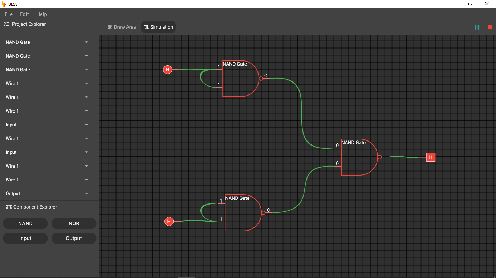

# BESS

> Under Development

BESS stands for Best Electrical Simulation Software. It is a simple simulation software currently simulating NAND and NOR Gates.

## To Do

- Fix some wiring bugs
- Project saving and loading
- Abstraction
- And other things 😁

