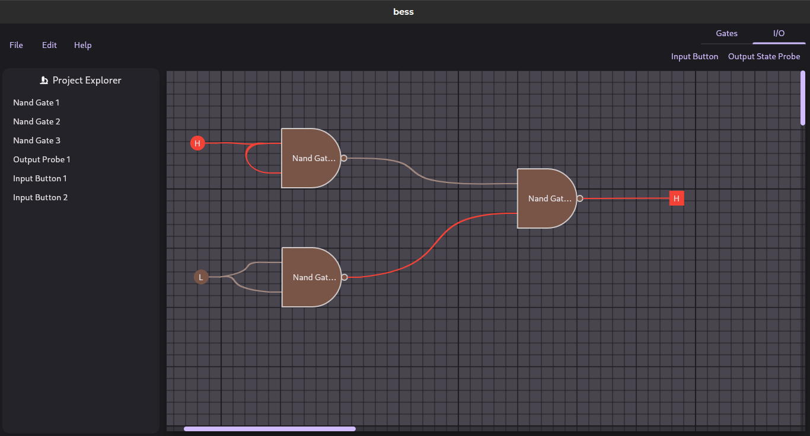

# BESS

> NOT UNDER DEVELOPEMNT -> check out opnegl branch for the new version of BESS

BESS stands for Best Electrical Simulation Software. It is a simple simulation software currently simulating NAND and NOR Gates.

