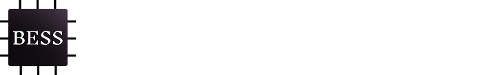
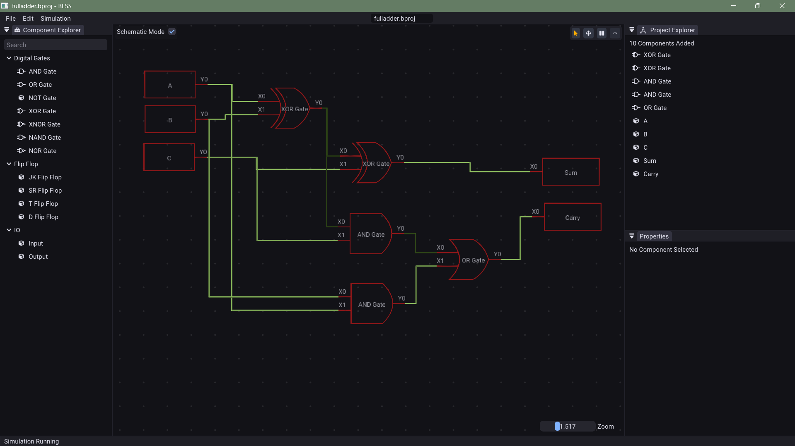

# 
[](https://github.com/shivang51/bess)
[](https://github.com/shivang51/bess/network/members)
[](https://github.com/shivang51/bess/issues)
[](https://github.com/shivang51/bess/blob/main/LICENSE)

BESS (Basic Electrical Simulation Software) is an open-source circuit simulator designed to be accessible, modern, and cross-platform.

The project began as an attempt to remove the barriers students often face when working with existing tools. Many popular circuit simulators are proprietary, restricted to a single operating system, or rely on outdated interfaces. BESS was created to provide a free, user-friendly, and modern alternative that works consistently across platforms. Its goal is to make learning and experimenting with circuits simpler and more approachable for everyone.

Check out [Bess Wiki](https://github.com/shivang51/bess/wiki) to see available components.
> Only digital components are there for now, analog components are planned for future.

## Screenshots

<div align="center" height="100px">
  
  
</div>

## Build & Run
Tested Build On:
- [x] Linux (Arch)
- [x] Windows
- [ ] MacOS

Following commands are only valid for Linux, as build scripts for windows have not been written yet.
All build scripts live in the **scripts/** folder inside the CMake source directory.

1. **Clean previous builds** (if you are building after another build)
   ```bash
   ./scripts/clean.sh
   ```
2. **Debug build & run**  
   ```bash
   ./scripts/build_run_debug.sh
   ```
3. **Release build**  
   ```bash
   ./scripts/build_release.sh
   ```
   - Copies assets automatically.
   - Binaries will be in `bin/Release/x64/`.
   - **Execute**  
       ```bash
       cd bin/Release/x64/
       ./Bess
       ```
## TODO
- [x] Add seven segment display (Added CLR for flip flops as well)
- [x] Add some graph visulization for clock cycles
- [x] Command System
- [x] Undo, Redo functionality (for most interactions done)
- [x] Test Cases for simulation engine
- [x] UI Improvements
- [ ] Moving to vulkan renderer
