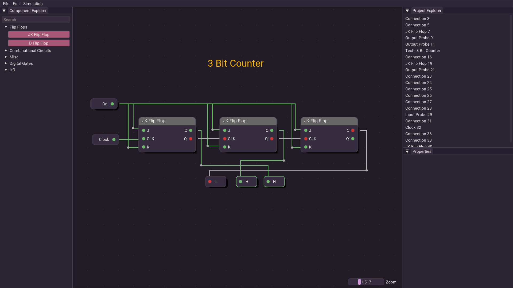
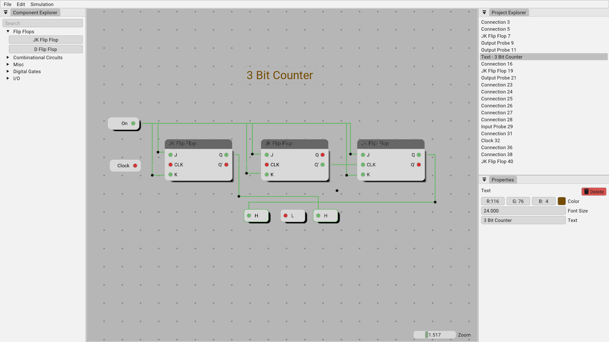

# Basic Electrical Simulation Software - BESS

> This branch will include EnTT integration, ui refactoring and new time based simulation engine.

BESS is a software for simulating electrical circuits. It is designed to be simple to use and easy to understand. It is intended for educational purposes, but can also be used for professional work.

It is written in `C++` and uses its own renderer made with `OpenGL`.

## Screenshots

Many themes are available, here are some examples:

