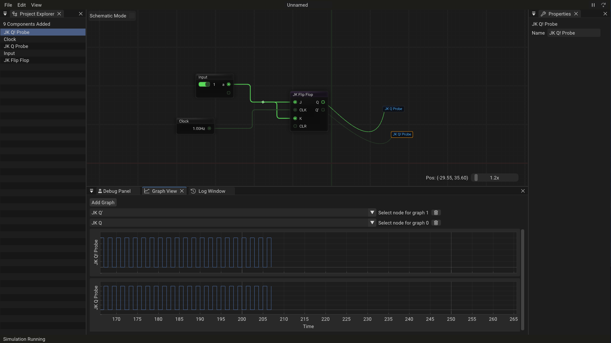
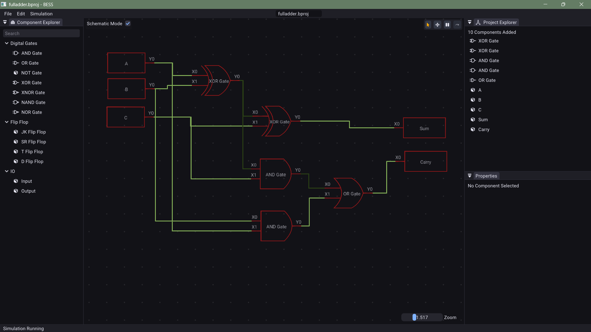

# 
[](https://github.com/shivang51/bess)
[](https://github.com/shivang51/bess/network/members)
[](https://github.com/shivang51/bess/issues)
[](https://github.com/shivang51/bess/blob/main/LICENSE)

[](https://discord.gg/cuB7c9q275)

BESS (Basic Electrical Simulation Software) is an open-source circuit simulator designed to be accessible, modern, and cross-platform.

The project began as an attempt to remove the barriers students often face when working with existing tools. Many popular circuit simulators are proprietary, restricted to a single operating system, or rely on outdated interfaces. BESS was created to provide a free, user-friendly, and modern alternative that works consistently across platforms. Its goal is to make learning and experimenting with circuits simpler and more approachable for everyone.

Check out [Bess Wiki](https://github.com/shivang51/bess/wiki) to see available components.
> Only digital components are there for now, analog components are planned for future.


https://github.com/user-attachments/assets/86f467ee-4160-4be6-a6de-626ed7a3e3a6


## Screenshots

<div align="center" height="100px">
  
  
</div>

## Build & Run
Tested Build On:
- [x] Linux (Arch Linux: Wayland)
- [x] Windows (Untested after plugin support was added)
- [x] MacOS

All build scripts live in the **scripts/** folder in the project root.
Dependency bootstrap is automatic in the build scripts.

Linux and macOS:

1. Clean previous builds.
   ```bash
   ./scripts/clean.sh
   ```
2. Debug build.
   ```bash
   ./scripts/build_debug.sh
   ```
3. Debug build and run.
   ```bash
   ./scripts/build_run_debug.sh
   ```
4. Release build.
   ```bash
   ./scripts/build_release.sh
   ```

Windows (PowerShell):

1. Clean previous builds.
   ```powershell
   powershell -ExecutionPolicy Bypass -File .\scripts\clean.ps1
   ```
2. Debug build.
   ```powershell
   powershell -ExecutionPolicy Bypass -File .\scripts\build_debug.ps1
   ```
3. Debug build and run.
   ```powershell
   powershell -ExecutionPolicy Bypass -File .\scripts\build_run_debug.ps1
   ```
4. Release build.
   ```powershell
   powershell -ExecutionPolicy Bypass -File .\scripts\build_release.ps1
   ```

Windows (cmd wrappers):

1. Debug build.
   ```bat
   scripts\build_debug.bat
   ```
2. Release build.
   ```bat
   scripts\build_release.bat
   ```

Output binaries are generated under `bin/<Config>/x64/`.

## TODO
- [x] Basic Plugin Suppport
- [x] Usability enhancements - [Details](https://github.com/shivang51/bess/pull/18)
- [x] Command System - [Details](https://github.com/shivang51/bess/pull/19)
- [x] Module Support - [Details](https://github.com/shivang51/bess/pull/20)
- [ ] Basic Verilog Support
- [ ] Add More components
