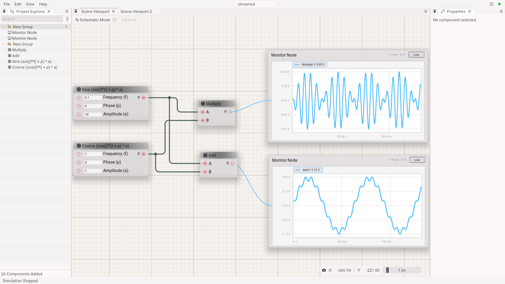
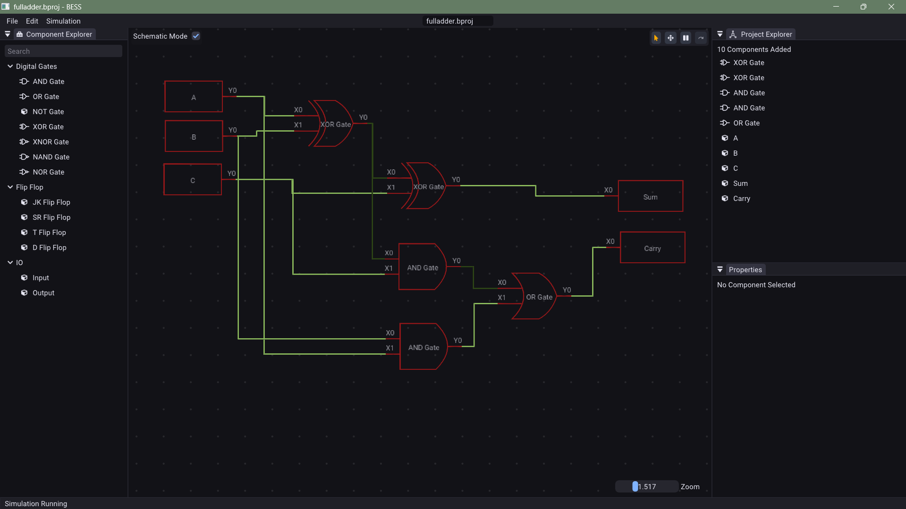

# 
[](https://github.com/shivang51/bess)
[](https://github.com/shivang51/bess/network/members)
[](https://github.com/shivang51/bess/issues)
[](https://github.com/shivang51/bess/blob/main/LICENSE)

[](https://discord.gg/cuB7c9q275)

BESS (Basic Electrical Simulation Software) is an open-source circuit simulator designed to be accessible, modern, and cross-platform.

The project began as an attempt to remove the barriers students often face when working with existing tools. Many popular circuit simulators are proprietary, restricted to a single operating system, or rely on outdated interfaces. BESS was created to provide a free, user-friendly, and modern alternative that works consistently across platforms. Its goal is to make learning and experimenting with circuits simpler and more approachable for everyone.

### Some of the nice things:
1. Very extensible:
   - One can write own plugins in Python to add new components, ui elements, and more.
   - One can write own simulation drivers to add more capablities. Currently I have digital components simulation driver and maths simulation driver.
2. Python plugins support hot reloading, for now only while in debug build.
3. Maintains good fps ~60fps for large components.
4. Verilog script import also works when working with digital components.
5. Cross platform support for windows and linux.


## Screenshots - [More](screenshots/README.md)

<div align="center" height="100px">
  
  
</div>

## Build & Run
Tested Build On:
- [x] Linux (Arch Linux: Wayland)
- [x] Windows (Running in Github Actions)
- [ ] MacOS - Can't test and does need work

Following commands are only valid for Linux.
All build scripts live in the **scripts/** folder inside the CMake source directory.

1. **Clean previous builds** (if you are building after another build)
   ```bash
   ./scripts/clean.sh
   ```
2. **Debug build & run**  
   ```bash
   ./scripts/build_run_debug.sh
   ```
3. **Release build**  
   ```bash
   ./scripts/build_release.sh
   ```
   - Copies assets automatically.
   - Binaries will be in `bin/Release/x64/`.
   - **Execute**  
       ```bash
       cd bin/Release/x64/
       ./Bess
       ```
## TODO
- [x] Architecture Overhaul and Usability Improvements - [Details](https://github.com/shivang51/bess/pull/25)
- [ ] Web Support
- [ ] LLM Integration
- [ ] Analog Component Support
