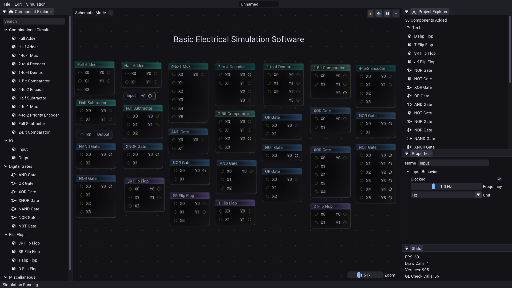
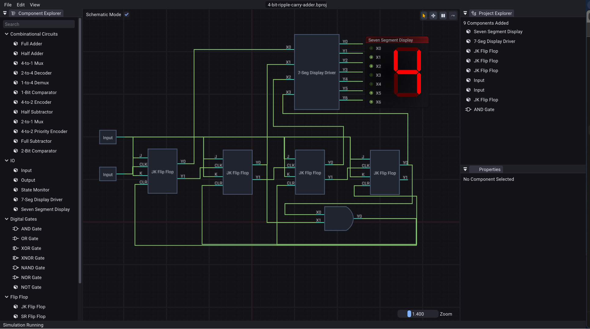

# 
[](https://github.com/shivang51/bess)
[](https://github.com/shivang51/bess/network/members)
[](https://github.com/shivang51/bess/issues)
[](https://github.com/shivang51/bess/blob/main/LICENSE)

BESS is a software for simulating electrical circuits (for now digital components). It is designed to be simple to use and easy to understand. It is intended for educational purposes, but can also be used for professional work.

It is written in `C++` and uses its own renderer made with `OpenGL`.
It now uses its own `Time Based Simulation Engine`.

## Screenshots

<div align="center">
  
  
</div>

## Build & Run
Tested Build On:
- [x] Linux (Arch)
- [x] Windows
- [ ] MacOS

Following commands are only valid for Linux, as build scripts for windows have not been written yet.
All build scripts live in the **scripts/** folder inside the CMake source directory.

1. **Clean previous builds** (if you are building after another build)
   ```bash
   ./scripts/clean.sh
   ```
2. **Debug build & run**  
   ```bash
   ./scripts/build_run_debug.sh
   ```
3. **Release build**  
   ```bash
   ./scripts/build_release.sh
   ```
   - Copies assets automatically.
   - Binaries will be in `bin/Release/x64/`.
   - **Execute**  
       ```bash
       cd bin/Release/x64/
       ./Bess
       ```
## TODO
- [x] Add seven segment display (Added CLR for flip flops as well)
- [x] Add some graph visulization for clock cycles
- [ ] Command System
- [ ] Test Cases for simulation engine
- [ ] Undo, Redo functionality
- [ ] Using emscripten to host on web
